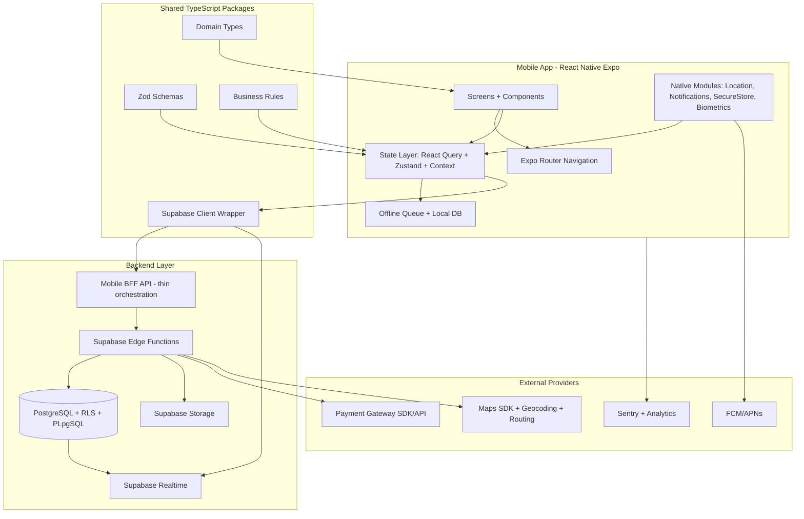
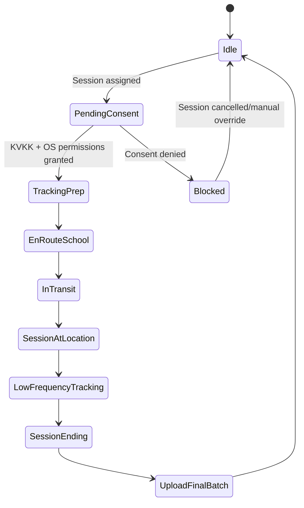
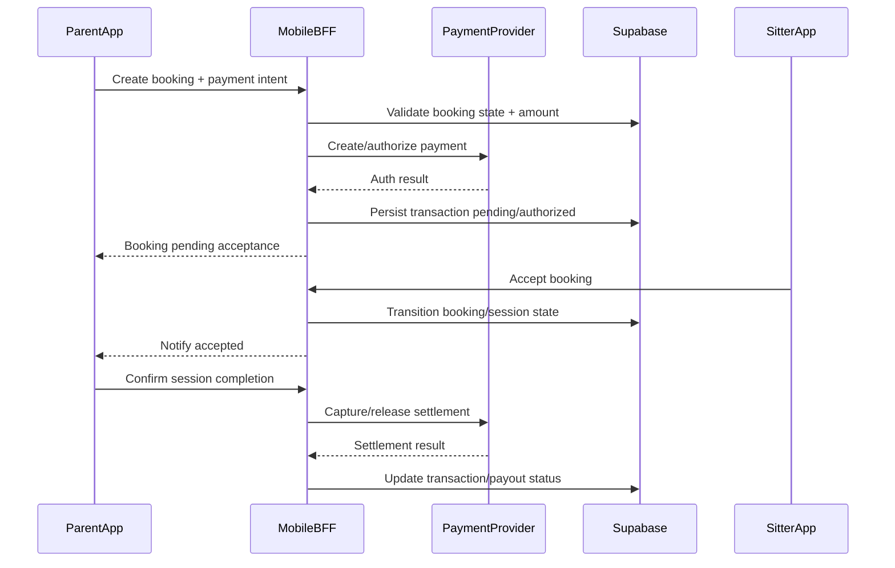
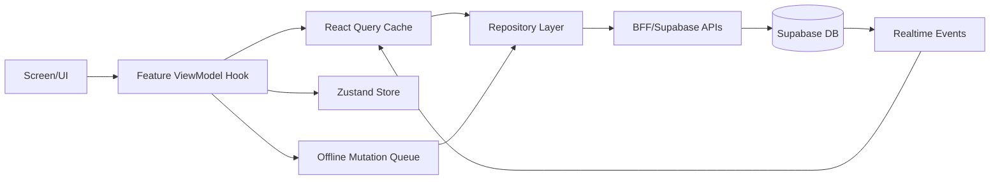
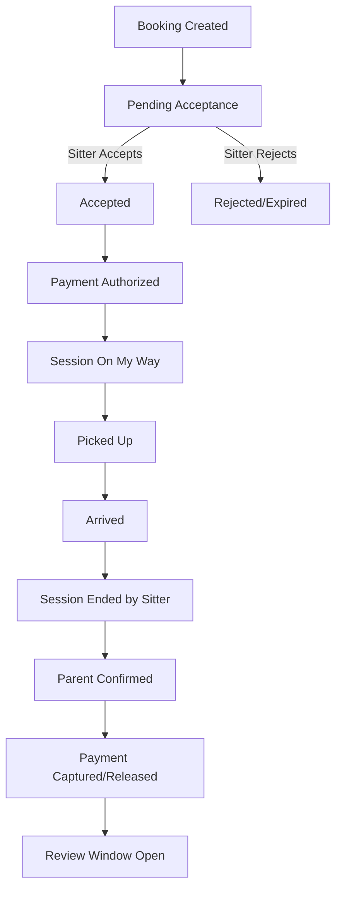

# KampusAbla Mobile Migration Plan (Production-Grade)

## 1. Purpose & Delivery Contract

This document is an execution-grade migration blueprint to move KampusAbla from its current web-first architecture to a production mobile architecture for iOS + Android, while preserving domain logic (verified sitter marketplace, booking/session lifecycle, child safety, KVKK compliance).

**Output intent:** each phase can be assigned directly to another coding agent as a standalone implementation task.

**Hard constraints reflected in this plan:**
- No assumption that map and payment integrations are production-complete today.
- Mobile architecture is designed to introduce map/payment SDKs cleanly from scratch.
- Existing repository assets (TypeScript logic + Supabase schema/functions) are reused where safe.
- Pilot geography remains Beşiktaş-first unless explicitly re-scoped, to stay aligned with current product assumptions.

---

## 2. Repository Analysis Summary (Current State)

## 2.1 Existing Architecture Snapshot
- Frontend is **Vite + React + TypeScript** (not Next.js runtime).
- Routing is centralized in `src/App.tsx` with lazy-loaded pages.
- Data access is mostly **direct Supabase client access** from hooks/services (no dedicated REST backend for most features).
- Domain and validation are already strongly typed:
  - `src/types/*`
  - `src/schemas/*` (Zod)
  - `src/lib/*` (booking/payment/cancellation/review logic)
- Backend capabilities exist in **Supabase migrations + Edge Functions**:
  - `supabase/migrations/*` (extensive SQL + RLS)
  - `supabase/functions/*` (payments, notifications, privacy/export, webhooks)
- Real-time capabilities already modeled through Supabase channels.

## 2.2 Implementation Status Assessment
- **Maps:** Web Google Maps components/services exist, but mobile-native map SDK strategy, background tracking policy, and battery controls are not production-complete.
- **Payments:** iyzico-oriented flow and Edge Functions exist, but some client behavior remains simulated/placeholder-like in parts of service layer, and mobile-native checkout UX/security boundaries are not yet hardened.
- **Offline + sync:** React Query persistence exists for web but not mobile-grade offline architecture (queue durability, conflict strategy, background retry).

## 2.3 Why React Native + Expo is the optimal migration choice

Given the repository is predominantly TypeScript and already structured around reusable domain modules:
- Maximum reuse of existing TS types/schemas/business rules.
- Faster delivery vs Flutter due to immediate reuse of:
  - Zod validation contracts
  - Supabase typed client contracts
  - domain utility logic
- Expo provides strong managed support for:
  - location/background tasks
  - push notifications
  - secure storage
  - EAS build/release

**Recommendation:** `React Native + Expo (TypeScript)`, with monorepo shared packages.

---

## 3. Target System Architecture

## 3.1 Core architectural decisions
1. **Monorepo-first:** keep web app intact, add mobile app and shared packages.
2. **Shared domain package:** centralize types/schemas/business logic to avoid drift.
3. **BFF for mobile-sensitive operations:** payment initiation, webhook-sensitive orchestration, anti-fraud controls, and key management.
4. **Supabase remains source of truth:** preserve RLS and SQL assets; extend where mobile requires new flows.
5. **Offline-first for mobility flows:** session status/location/event queue must survive app restarts and poor connectivity.

---

## 4. Proposed Monorepo Structure

## 4.1 Target directories
- `apps/web/` (current web app, moved or retained with minimal refactor)
- `apps/mobile/` (new Expo app)
- `packages/shared-domain/`
  - `types/`
  - `schemas/`
  - `business-rules/`
  - `constants/`
- `packages/shared-data/`
  - `supabase-client/`
  - `query-keys/`
  - `repositories/`
- `packages/shared-ui-tokens/` (optional, for design tokens and theming contracts)

## 4.2 Reuse mapping from current repo
- Copy/adapt from current repo into `packages/shared-domain`:
  - `src/types/*`
  - `src/schemas/*`
  - `src/lib/booking.ts`, `payment.ts`, `cancellation.ts`, `review.ts`
- Adapt into `packages/shared-data`:
  - Supabase typed client setup (`src/integrations/supabase/*`)
  - query key conventions from hooks
- Keep web-only implementations in web app (DOM/Google Maps JS-specific code not shared directly).

---

## 5. Backend Readiness & BFF Strategy

## 5.1 Current backend assessment
- Strengths:
  - Mature SQL migration history and RLS posture.
  - Existing edge function capability for payment/webhooks/notifications.
  - Existing session/location/payment domain tables.
- Gaps for mobile:
  - Inconsistent orchestration boundaries (client still owns too much control in some flows).
  - No explicit mobile-focused API contract layer.
  - Need idempotency and offline replay safety for intermittent networks.

## 5.2 BFF recommendation
Create **Mobile BFF layer** (can be Supabase Edge Functions or a dedicated Node service) for operations requiring strict server authority.

### Must go through BFF
- Booking creation/acceptance/transition state machine operations.
- Payment intent/create/capture/refund operations.
- Location session authorization token issuance.
- Notification fan-out orchestration.
- Dispute creation with evidence metadata signing.

### Can remain direct Supabase (RLS-protected)
- Read-heavy screens: sitter discovery snapshots, static profile data, review feeds.
- Non-sensitive user preference updates.

## 5.3 API contract standardization
Define uniform response contracts for mobile:
- success envelope
- typed error codes
- retry semantics (`retryable`, `retryAfter`)
- correlation IDs for observability

---

## 6. Maps & Mobility SDK Architecture (From Scratch)

## 6.1 Recommended providers
- **Primary Maps SDK:** Google Maps (best Istanbul coverage + routing maturity).
- **Optional abstraction-ready fallback:** Mapbox support via provider interface.

## 6.2 Mobile map module boundaries
Create a provider-agnostic `MapProviderAdapter` contract with modules:
- `MapViewRenderer`
- `Geocoder`
- `RouteService`
- `DistanceService`
- `GeofenceService` (phase-gated)

## 6.3 Background location architecture
- Session-based tracking modes:
  1. Foreground high-accuracy during pickup/transit.
  2. Reduced frequency during static edu-sitting period.
  3. Immediate stop when session ends.
- Adaptive interval policy:
  - speed-aware sampling
  - battery-aware fallback
  - connectivity-aware queueing

## 6.4 Location data integrity
- Each location event should include:
  - session ID
  - timestamp (device + server receipt)
  - accuracy
  - speed (if available)
  - battery level (optional analytics)
- Server-side validation:
  - outlier detection (impossible jumps)
  - stale timestamp rejection
  - duplicate event dedupe

---

## 7. Payments Architecture (From Scratch for Mobile)

## 7.1 Recommended payment path
- **Primary:** iyzico marketplace model (sub-merchant payouts) due Turkish market fit.
- **Secondary option:** Papara integration path retained via provider abstraction.

## 7.2 Payment module boundaries
- `PaymentProviderAdapter`
  - `createCustomerPaymentIntent`
  - `confirmPayment`
  - `createSubMerchant`
  - `createPayout`
  - `refundTransaction`
- Keep all provider secret signing and webhook verification strictly server-side.

## 7.3 Payment lifecycle for bookings

## 7.4 Anti-fraud & reliability controls
- Idempotency keys on all payment state mutations.
- Webhook replay protection.
- Server-side amount derivation only.
- Risk flags for suspicious booking/payment mismatches.

---

## 8. Mobile App Internal Architecture

## 8.1 Navigation
- Use **Expo Router** with role-aware protected route groups.
- Route groups:
  - `(auth)`
  - `(parent)`
  - `(sitter)`
  - `(shared)`
  - `(admin-lite optional)`

## 8.2 State management blueprint
- **React Query:** server-state caching, retries, background refetch.
- **Zustand:** ephemeral UI/app state (filters, map camera, flow wizards).
- **Context:** auth/session lifecycle, feature flags.
- **Durable local store:** SQLite/Realm/MMKV-backed queue for offline mutations.

## 8.3 Feature modules
- `features/auth`
- `features/onboarding`
- `features/search`
- `features/booking`
- `features/session-tracking`
- `features/chat`
- `features/payments`
- `features/reviews`
- `features/safety-disputes`
- `features/settings-kvkk`

Each feature contains:
- screens
- components
- hooks/viewmodels
- repository calls
- validation contracts
- test files

---

## 9. Data & Domain Migration Plan

## 9.1 Shared domain extraction (first technical milestone)
- Extract and normalize domain contracts from web into shared packages.
- Define versioned schema exports to avoid breaking mobile release compatibility.
- Create compatibility test suite ensuring web and mobile use identical validation rules.

## 9.2 Database evolution for mobile
Add migrations for:
- device registration table (push tokens, platform, app version)
- location batch ingestion table (optional staging before canonical insert)
- idempotency key table for mutation replay safety
- session tracking quality table (accuracy metrics)
- mobile app attestation metadata

## 9.3 Event model hardening
- Introduce event versioning for session and booking transitions.
- Event-log audit trail definition: write immutable lifecycle records (who/what/when/version) for booking/session/payment transitions without replacing existing relational tables.
- Add immutable event log table for key lifecycle transitions.
- Preserve current table model; append event-log audit trail for mobile reliability.

---

## 10. Security, KVKK, and Safety-by-Design

## 10.1 Mandatory mobile security controls
- Secure token storage (Keychain/Keystore only).
- Certificate pinning for production API domains.
- Device integrity checks (Play Integrity / DeviceCheck or equivalent).
- Runtime environment checks (debugger/root/jailbreak risk signal).
- Redaction policy for logs and crash reporting.

## 10.2 KVKK-compliant consent flow
- Distinct consents:
  - child data processing
  - location tracking during active sessions
  - optional marketing notifications
- Consent capture requirements:
  - versioned consent text hash
  - timestamp + IP/device metadata
  - explicit revocation support

## 10.3 Child safety controls
- Strict role checks on child profile operations.
- No session start unless verification + payment + consent preconditions satisfied.
- In-app communication guardrails (phone/email leakage detection at API layer).

---

## 11. Performance & Reliability Risk Register

## 11.1 Primary bottlenecks and mitigations
1. **Live map rendering jank**
   - Mitigation: marker clustering, route simplification, memoized map layers.
2. **Battery drain from GPS**
   - Mitigation: adaptive sampling, geofence-based throttling, low-power mode.
3. **Network instability causing duplicate writes**
   - Mitigation: idempotent mutation API + offline durable queue + server dedupe.
4. **Realtime channel churn**
   - Mitigation: feature-scoped subscriptions and lifecycle-aware teardown.
5. **Large payload screens**
   - Mitigation: cursor pagination + partial hydration of profile/review details.

## 11.2 Operational SLIs/SLOs (mobile)
- Booking mutation success rate ≥ 99.5%
- Session event delivery within 10s p95
- Location event ingest failure < 1% per session
- Crash-free sessions ≥ 99.7%
- Payment confirmation mismatch = 0 tolerated (with automated alerting)
- These targets are initial launch objectives; establish baseline metrics during pilot and recalibrate thresholds after 2-4 weeks of production telemetry (typically enough to capture weekday/weekend demand patterns plus early incident trends).

---

## 12. Execution Plan (Granular, Agent-Ready)

## Phase 1 — Repository & Monorepo Foundation
- [ ] Create workspace structure for `apps/mobile` and `packages/*`.
- [ ] Configure shared TypeScript project references.
- [ ] Establish lint/format/test tooling parity for mobile packages.
- [ ] Define CI matrix split (web/mobile/shared).

**Files to create/update (conceptually):**
- workspace root package manager config
- root TS config references
- mobile app scaffold config files
- shared package manifest and TS build configs

## Phase 2 — Shared Domain Extraction
- [ ] Move/copy reusable types and schemas into `packages/shared-domain`.
- [ ] Move/copy deterministic business rules (booking/payment/cancellation/review).
- [ ] Add contract tests to guarantee no behavior drift.

**Files:**
- shared domain index exports
- migration map document (old path -> new path)
- test suites validating schema/business parity

## Phase 3 — Shared Data Layer
- [ ] Introduce `packages/shared-data` with repository interfaces.
- [ ] Wrap Supabase interactions behind repositories.
- [ ] Define query keys and mutation contracts for mobile/web reuse.

**Files:**
- repository interfaces by domain (booking/session/review/payment)
- Supabase adapter implementations
- query-key definitions

## Phase 4 — Mobile App Bootstrap (Expo)
- [ ] Initialize Expo app with strict TypeScript.
- [ ] Set up Expo Router route groups and auth guards.
- [ ] Add base design system tokens and themed primitives.

**Files:**
- app entry/routing files
- provider composition root
- theme and localization bootstrap

## Phase 5 — Authentication & Session Management
- [ ] Implement Supabase auth in mobile with secure token persistence.
- [ ] Add phone OTP + email verification flows.
- [ ] Implement session timeout, refresh, and forced sign-out handling.

**Files:**
- auth repository + hooks
- secure storage adapter
- auth screens for login/register/verify/reset

## Phase 6 — Parent/Sitter Onboarding
- [ ] Port onboarding steps using shared schemas.
- [ ] Build child profile management forms.
- [ ] Build sitter verification submission flow (documents + status).

**Files:**
- onboarding feature screens/components
- upload service adapters
- validation-bound form viewmodels

## Phase 7 — Search & Discovery
- [ ] Implement sitter search list and map tabs.
- [ ] Add filter state and query synchronization.
- [ ] Implement map marker clustering + detail bottom sheets.

**Files:**
- search feature modules
- map provider adapter and map UI components
- filter store + query integration

## Phase 8 — Booking & Need Posts
- [ ] Port direct booking wizard.
- [ ] Port need-post create/browse/apply lifecycle.
- [ ] Add mutation idempotency and optimistic update rollback.

**Files:**
- booking flow screens
- need-post flow screens
- booking/need repositories and mutation hooks

## Phase 9 — Session Lifecycle & Live Tracking
- [ ] Implement session status transitions UI for both roles.
- [ ] Integrate background-safe location tracking service.
- [ ] Build parent live tracking map with connection/state indicators.

**Files:**
- session-tracking feature module
- location permission/orchestration module
- realtime subscription handlers

## Phase 10 — Payments Integration Layer
- [ ] Introduce payment provider abstraction in backend + mobile client contract.
- [ ] Implement mobile checkout flow for booking authorization.
- [ ] Add payout and refund status views for sitter/parent.

**Files:**
- payment adapter interfaces
- payment feature screens and status components
- server orchestration endpoints/functions

## Phase 11 — Chat, Notifications, and Alerts
- [ ] Port in-app chat with moderation constraints.
- [ ] Implement FCM/APNs token registration and targeted push delivery.
- [ ] Add critical alert templates (session started, pickup, emergency/report).

**Files:**
- chat feature module
- notification registration/service modules
- backend notification templates and dispatch orchestration

## Phase 12 — Safety, Reports, and Disputes
- [ ] Port safety center and report submission flows.
- [ ] Add evidence upload and structured issue taxonomy.
- [ ] Implement admin-facing dispute state transitions in backend contracts.

**Files:**
- safety/dispute screens
- dispute repository + API contracts
- backend validation and status rules

## Phase 13 — Offline & Sync Engine
- [ ] Implement durable mutation queue with retry policies.
- [ ] Add conflict resolution strategy per entity type.
- [ ] Add connectivity-aware mode switching and queue observability.

**Files:**
- offline queue storage module
- sync worker/orchestrator
- conflict resolution policy map

## Phase 14 — Security Hardening
- [ ] Add cert pinning, attestation hooks, and runtime threat checks.
- [ ] Ensure all sensitive endpoints are BFF-only.
- [ ] Redact PII from logs and telemetry.

**Files:**
- security module and policy configs
- networking layer hardening config
- telemetry scrubbing middleware

## Phase 15 — Observability & Analytics
- [ ] Define mobile event taxonomy aligned with business metrics.
- [ ] Add crash/performance tracing and backend correlation IDs.
- [ ] Build ops dashboards for session/payment/location health.

**Files:**
- analytics event schema files
- observability middleware
- dashboard query specifications

## Phase 16 — Test Architecture
- [ ] Unit tests for shared domain and repositories.
- [ ] Integration tests for mobile-critical flows (booking, payment, session).
- [ ] E2E mobile tests for core user journeys.

**Files:**
- test setup and fixture libraries
- integration suite for BFF contracts
- E2E specs per journey

## Phase 17 — Compliance & Legal Finalization
- [ ] KVKK consent screens and policy version tracking.
- [ ] Data retention/erasure workflows verified on mobile pathways.
- [ ] Legal text localization and auditability checks.

**Files:**
- legal/consent screen content bindings
- consent audit logging contracts
- retention policy enforcement docs/scripts

## Phase 18 — Pilot Rollout (Beşiktaş)
- [ ] Internal alpha with seeded users and synthetic sessions.
- [ ] Controlled beta with feature flags for tracking/payment modules.
- [ ] Runbook for incidents, rollback, and provider outages.
- Pilot location rationale: Beşiktaş aligns with current product scope (private/international school density, target parent demographic, and existing pricing assumptions); if pilot district changes, re-baseline supply density, average route distance, and price elasticity before launch.

**Files:**
- feature flag configuration
- rollout checklist artifacts
- incident runbook documents

## Phase 19 — Store Readiness
- [ ] App Store / Play Store compliance pack.
- [ ] Privacy manifest and permission justifications.
- [ ] Release signing and CI/CD pipelines.

**Files:**
- store metadata and policy documents
- release pipeline config
- secrets management and environment matrix

## Phase 20 — GA & Continuous Improvement
- [ ] Post-launch monitoring and KPI review cadence.
- [ ] Prioritized backlog for v1.1 (advanced filters, geofencing, payment alternatives).
- [ ] Quarterly architecture reviews for scale and safety.

**Files:**
- post-launch analytics review templates
- v1.1 roadmap definitions
- architecture decision records (ADRs)

---

## 13. Detailed Feature-by-Feature Mobile Build Checklist

## 13.1 Parent app checklist
- [ ] Registration/login/verification
- [ ] Child profile CRUD
- [ ] Search sitters (list + map)
- [ ] Booking and need-post creation
- [ ] Live session tracking
- [ ] Payment checkout and receipts
- [ ] Review submission
- [ ] Dispute/report submission

## 13.2 Sitter app checklist
- [ ] Registration/login/verification upload
- [ ] Sitter profile + service area setup
- [ ] Need post browsing + application
- [ ] Booking acceptance workflow
- [ ] Session status transitions + tracking publish
- [ ] Earnings/payout visibility
- [ ] Review visibility and response

## 13.3 Shared safety checklist
- [ ] KVKK consent before location tracking
- [ ] Dual verification enforcement (where required)
- [ ] Chat leakage blocking server-side
- [ ] Emergency/report CTA accessible during active session

---

## 14. State Transition Contracts (Booking + Session)

**Non-negotiable rules:**
- Session cannot start without booking acceptance and valid payment authorization state.
- Review window opens only after session confirmation.
- Cancellation policy calculations stay server-authoritative.

---

## 15. Release Environments & Configuration Matrix

## 15.1 Environments
- local
- dev
- staging
- production

## 15.2 Config categories
- Supabase project IDs and keys
- map provider keys/restrictions
- payment provider credentials/webhook secrets
- push notification credentials
- telemetry DSNs/sample rates

## 15.3 Config governance
- Runtime config loaded by environment.
- No provider secret in mobile client bundle.
- Mandatory startup validation with fail-fast for missing critical keys.

---

## 16. Agent Handoff Templates (Per-Phase Execution)

For each phase assignment to coding assistants, provide:
1. Objective
2. Exact file targets
3. Domain constraints (safety/KVKK/payment)
4. Acceptance criteria
5. Test scope
6. Rollback notes

Use this fixed acceptance format:
- Functional acceptance
- Security acceptance
- Performance acceptance
- Observability acceptance
- Documentation acceptance

---

## 17. Final Recommendation Summary

1. Proceed with **React Native + Expo + TypeScript monorepo**.
2. Extract shared domain/data packages first to unlock safe parallel work.
3. Introduce a **mobile BFF boundary** for sensitive workflows (payments, lifecycle transitions, anti-fraud, idempotency).
4. Implement map/payment as adapter-based modules so provider changes do not ripple across app logic.
5. Prioritize session tracking reliability, battery efficiency, and KVKK-grade consent/auditability as first-class architecture goals.

This sequencing minimizes migration risk, maximizes reuse from the current TypeScript-heavy codebase, and establishes a production-safe path for mobility-grade real-time operations.
